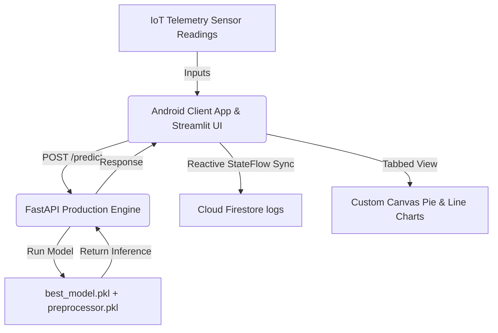

# 🍄 Smart Mushroom Farming AI

[](https://developer.android.com/jetpack/compose)
[](https://fastapi.tiangolo.com/)
[](https://firebase.google.com/)
[](https://scikit-learn.org/)
[](https://streamlit.io/)

An end-to-end, production-ready AI-powered IoT environmental monitoring and disease risk prediction system for mushroom cultivation.

---

## 📌 Project Overview

Mushroom cultivation is highly sensitive to environmental factors. Tiny variations in temperature, humidity, ventilation, light, or pH can reduce crop yield or cause fungal disease outbreaks. 

This project provides a full-stack, AI-powered system designed to simulate sensor data from a mushroom cultivation room, run real-time diagnostics, and deliver actionable recommendations to growers:



---

## ⚡ Core Features

### 1. Jetpack Compose Client Application
*   **Dual-Tab Analytics Dashboard**: 
    *   *Overview*: Displays active temperature, humidity, ventilation, pH, and light conditions with Material 3 status badges alongside AI recommendations.
    *   *Analytics & Trends*: Renders custom **Canvas-drawn Pie Charts** for risk breakdowns and **Canvas Line Charts** mapping risk trends across flushes.
*   **Persistent Historical Logs**: Complete database sync with real-time text query searching and chip filters (*Newest First*, *Healthy Only*, etc.).
*   **Seamless Profile Preferences**: Built-in Firebase metadata display showing account creation dates, total logs, and dark theme preferences.

### 2. Streamlit Web Dashboard
*   Interactive sliders and dropdown controls to quickly test environmental conditions.
*   Color-coded health status diagnostics (Good, Moderate, Bad).
*   Visual comparison charts showing how current parameters align with optimal growth thresholds.

### 3. Machine Learning Prediction Pipeline
*   **Preprocessing (`preprocessing.py`)**: Implements StandardScaler pipelines caching features for consistent transformation mappings.
*   **Inference Engine (`predict.py`)**: Runs vectorized predictions returning health statuses (*Healthy, Moderate, High Risk*), confidence scores, and action guidelines.
*   **REST Wrapper API**: Formulates Pydantic input-validation constraints verifying telemetry criteria.

---

## 🛠️ Technology Stack

| Component | Framework / Library | Role |
| :--- | :--- | :--- |
| **Android UI** | Jetpack Compose (Kotlin) | Modern declarative UI design system |
| **Web UI** | Streamlit (Python) | Interactive telemetry test dashboard |
| **Networking** | Retrofit 2 + OkHttp | High-performance type-safe REST communication |
| **DI Engine** | Hilt / Dagger | Dependency injection bindings |
| **Analytics Engine** | Custom Android Canvas APIs | Zero-dependency responsive graphing |
| **Backend REST** | FastAPI (Python) | Production-ready model execution wrapper |
| **Database** | Firebase Auth + Cloud Firestore | Real-time user logs & authentication gateways |
| **Inference Model** | scikit-learn (Random Forest) | Climatic disease probability calculator |

---

## 📂 Repository Structure

```text
├── backend/                  # FastAPI App REST service
│   ├── app.py                # Main API routes (Health, /predict)
│   └── schemas.py            # Pydantic schema validation contracts
├── models/                   # Cached Preprocessor & Model binaries
│   ├── best_model.pkl
│   └── preprocessor.pkl
├── smart-mushroom-farming-android/   # Jetpack Compose App Project
│   ├── app/                  # Main Android module
│   │   └── src/main/java/com/smart/mushroomfarming
│   │       ├── config/       # Base App URLs (production endpoints)
│   │       ├── data/         # Retrofit API clients & Repositories
│   │       └── ui/           # Compose screens (Dashboard, Predict, History, Settings)
├── app.py                    # Streamlit web dashboard
├── predict.py                # Command-line prediction wrapper
├── preprocessing.py          # Data scaling pipelines
├── train.py                  # Training execution logic
└── README.md                 # Project Documentation
```

---

## 🚀 Setup & Execution Guide

### 1. Launching the Backend REST API
Ensure you have Python 3.9+ installed. Run the following inside the root directory:
```bash
# Install dependencies
pip install -r backend/requirements.txt

# Run FastAPI local server
uvicorn backend.app:app --host 0.0.0.0 --port 8000
```
API endpoints will be exposed at `http://localhost:8000/docs`.

### 2. Launching the Streamlit Web Dashboard
```bash
# Install Streamlit and visualization libs
pip install streamlit pandas numpy matplotlib seaborn scikit-learn

# Run Web Dashboard
streamlit run app.py
```
The app will open in your browser at `http://localhost:8501`.

### 3. Building the Android Client Application
1.  Open the `smart-mushroom-farming-android/` directory in **Android Studio**.
2.  Add your Firebase configuration file `google-services.json` inside the `app/` directory module.
3.  Ensure your base API address inside `AppConfig.kt` points to your active backend host URL:
    ```kotlin
    object AppConfig {
        const val BASE_URL = "https://smart-mushroom-farming.onrender.com/"
    }
    ```
4.  Build and run the project:
    ```bash
    ./gradlew assembleDebug
    ```

---

## 👨‍💻 Author
**Riwitika Gupta**

---

## 📝 License
This project is open-source and available under the MIT License.
